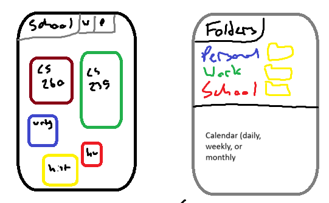

# LoadMap

[My Notes](notes.md)

LoadMap is a web application designed to help students visualize and manage their academic workload. Instead of relying on simple to-do lists or excel spreadsheets, LoadMap shows how heavy or light a student’s schedule is across daily, weekly, and monthly views by weighting assignments based on due dates, importance, and estimated worklaod. Students will be able to plan out not just academic deadlines, but personal and work goals and deadlines as well. Calendar view will also allow students to be able to properly organize themselves. This allows students to plan ahead, avoid burnout, and make informed decisions about their time.

> [!NOTE]
> This README.md file documents the progress of the application across multiple deliverables. Each section corresponds to a specific Canvas submission and includes a checklist of rubric items along with descriptions of completed work.

---

## 🚀 Specification Deliverable

For this deliverable I completed the following items.

- [x] Proper use of Markdown
- [x] A concise and compelling elevator pitch
- [x] Description of key features
- [x] Description of how I will use each technology
- [x] One or more rough sketches of the application

---

### Elevator pitch

College students often know what assignments they have due, but not how heavy their overall workload really is. LoadMap helps students visualize their academic load using daily, weekly, and monthly planning views. By weighting assignments based on due dates and importance, LoadMap highlights busy days and stressful weeks, allowing students to plan ahead, distribute work more evenly, and reduce last-minute stress.

---

### Design

The application uses a calendar-based layout with three primary views: daily, weekly, and monthly. The weekly view is the main planning interface, displaying assignment density and total workload per day. The monthly view provides a high-level overview to identify heavy weeks in advance, while the daily view focuses on detailed task planning. Students will be able to swap between School, Work, and Personal planning and see their individual folders as well.

Assignments are visually represented using color intensity and bars to indicate workload weight. Users can add, edit, or delete assignments, and the visual workload updates immediately to reflect changes.

---

### Key features

- Daily, weekly, and monthly planning views
- Visual workload indicators based on assignment weight
- Assignment creation, editing, and deletion
- Forecasting of heavy workload days and weeks
- User accounts with saved personal data
- Personal, Work, and Academic planning
- Calendar view to see overview of assignments

---

### Technologies

I am going to use the required technologies in the following ways:

- **HTML**  
  Used to structure the application layout, including navigation, calendar views, forms, and modals.
- **CSS**  
  Used for responsive design, visual hierarchy, and color-coded workload indicators.
- **React**  
  Used to create reusable components such as calendar views, assignment cards, and input forms. React state and hooks will manage assignment data and view switching.
- **Service**  
  A Node.js and Express backend will handle API requests for creating, updating, and retrieving assignments and workload data.
- **DB/Login**  
  MongoDB will store user credentials and assignment data. Authentication will ensure each user only accesses their own data.
- **WebSocket**  
  WebSockets will provide real-time updates so that assignment changes instantly update workload visualizations.

## 🚀 AWS deliverable

For this deliverable I did the following. I checked the box `[x]` and added a description for things I completed.

- [x] **Server deployed and accessible with custom domain name** - [My server link](https://loadmap.click).

## 🚀 HTML deliverable

For this deliverable I did the following. I checked the box `[x]` and added a description for things I completed.

- [x] **HTML pages** - I made 5 different pages: Home, Tasks, Calendar, Notes, and About
- [x] **Proper HTML element usage** - I spent a lot of time working on the navigation elements and placeholder elements.
- [x] **Links** - I put a link to my GitHub repo and links between pages.
- [x] **Text** - Most of the pages have some sort of text.
- [x] **3rd party API placeholder** - I put this placeholder on the calendar page to use Google Calendar.
- [x] **Images** - I made a gallery on the home page to put images.
- [x] **Login placeholder** - I put a login placeholder at the top of the home page.
- [x] **DB data placeholder** - I put this in a dashboard at the top of the home page.
- [x] **WebSocket placeholder** - I put this in a dashboard at the top of the home page.

## 🚀 CSS deliverable

For this deliverable I did the following. I checked the box `[x]` and added a description for things I completed.

- [x] **Header, footer, and main content body** - I made a header, footer, and overall style guide with specific colors.
- [x] **Navigation elements** - I made the navigation links apart of the styled header. (Bootstrap)
- [x] **Responsive to window resizing** - I made sure the pages resize with the window. (Mainly with Bootstrap and the flex elements.)
- [x] **Application elements** - I did a lot of overall styling of the various elements, especially the placeholders, to match the branding and colors that I want.
- [x] **Application text content** - I mainly styled the organization of it and allignment.
- [x] **Application images** - I styled the gallery on the home page.

## 🚀 React part 1: Routing deliverable

For this deliverable I did the following. I checked the box `[x]` and added a description for things I completed.

- [x] **Bundled using Vite** - I just followed the commands to install and use Vite.
- [x] **Components** - Moving the files and folders around along with the html and css code was pretty straightforward but it took a lot to figure out the difference between the home page and app.jsx.
- [x] **Router** - I had to rework the given router code a good bit once moving my files and folders around.

## 🚀 React part 2: Reactivity deliverable

For this deliverable I did the following. I checked the box `[x]` and added a description for things I completed.

- [x] **All functionality implemented or mocked out** - I added the login feature (making certain pages invisible), add the filter function for tasks and notes, added functionality to add new notes and tasks, made the click away feature reactive for the tasks, and connected the calendar to the tasks that are made to show which days have tasks due and how many (along with the various pop up pages for adding tasks, notes, and seeing tasks on calendar days.)
- [x] **Hooks** - useState manages application state such as tasks, notes, and authentication, while useEffect persists data to localStorage to maintain state across sessions. Hooks enable reactive UI updates throughout the application.

## 🚀 Service deliverable

For this deliverable I did the following. I checked the box `[x]` and added a description for things I completed.

- [x] **Node.js/Express HTTP service** - I created an Express backend in a separate service directory that runs on port 4000 and handles API requests from the frontend.
- [x] **Static middleware for frontend** - Express uses static middleware to serve the built frontend files when deployed.
- [x] **Calls to third party endpoints** - The frontend calls the public Advice Slip API using fetch to retrieve a random motivational quote for the home dashboard.
- [x] **Backend service endpoints** - Implemented REST API routes for tasks:
    - GET /api/tasks
    - POST /api/tasks
    - DELETE /api/tasks/:id
    - Tasks are now stored and managed by the backend service instead of local storage.
- [x] **Frontend calls service endpoints** - The React Tasks component loads, creates, and deletes tasks using fetch requests to the Express API.
- [x] **Supports registration, login, logout, and restricted endpoint** - Added backend authentication routes. User passwords are hashed using bcrypt before being stored on the server. Implemented a protected route (GET /api/restricted) that verifies a user session via cookies. A test button on the home page demonstrates that the endpoint is accessible only when logged in.

## 🚀 DB deliverable

For this deliverable I did the following. I checked the box `[x]` and added a description for things I completed.

- [x] **Stores data in MongoDB** - Tasks and notes are stored in MongoDB collections and accessed through backend API routes. All data is persisted and retrieved per user using a userId field, ensuring data is not stored in memory.
- [x] **Stores credentials in MongoDB** - User accounts are stored in MongoDB with securely hashed passwords using bcrypt. Authentication is handled through login endpoints that validate credentials against stored hashes.

## 🚀 WebSocket deliverable

For this deliverable I did the following. I checked the box `[x]` and added a description for things I completed.

- [ ] **Backend listens for WebSocket connection** - I plan to implement a WebSocket server on the backend using the `ws` library to accept client connections and manage active sessions.
- [ ] **Frontend makes WebSocket connection** - I will connect the frontend to the backend using a WebSocket client and maintain a persistent connection for receiving updates.
- [ ] **Data sent over WebSocket connection** - I will send real-time updates from the backend whenever tasks or notes are created or deleted, broadcasting changes to all connected clients.
- [ ] **WebSocket data displayed** - The frontend will listen for WebSocket messages and update the UI dynamically so tasks and notes appear instantly without refreshing.
- [ ] **Application is fully functional** - The application will support real-time synchronization of tasks and notes across multiple browser sessions using WebSockets.
